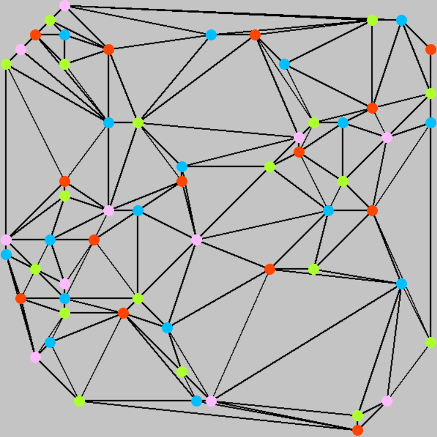

# Constraint satisfaction problems – report

The task was about using AI to solve two of the most famous CSPs – map/graph colouring and zebra puzzle/Einstein's riddle. Every CSP consist of 3 key elements – variables, domains and contraints. Before implementing the solvers, it is crucial to properly formulate the problems in regard to these 3 elements.

### Map colouring
In this problem we have a set of countries sharing the border, which in case of this implementation is represented as a set of vertices in the graph connected with edges. Each country in the map should be coloured possibly with minimal number of colour that no country share the colour with the neighbour. As four colour theorem states:
> "Given any separation of a plane into contiguous regions, producing a figure called a _map_, no more than four colors are required to color the regions of the map so that no two adjacent regions have the same color. _Adjacent_ means that two regions share a common boundary curve segment, not merely a corner where three or more regions meet." – [Wikipedia](https://en.wikipedia.org/wiki/Four_color_theorem)

Therefore, we can expect from the implementation that each map should be coloured using maximally 4 colours. It is also possible to colour some maps with 3 colour (or less if the map is trivial), but it is not consistent.

Considering all of that, now we can distinguish the most important elements of this problem:
* **Variables** – in our representation of the problem, these are simply the vertices/nodes in the graph.
* **Domains** – domains include all the possible values that a variable can have, so in our case, domains consists of available colours.
* **Constraints** – we have only one type of constraint – neighbouring vertex cannot share the colour with the current vertex. It means that each edge represents a constraint between a pair of variables.

### Zebra puzzle
This problem seems to be a little more complicated – constraints seems to be more complicated and there are more types of them. Also, there is a problem to choose the variables – we can specify them as:
* houses
* house colours, cigarettes etc.
* every available option – red house, milk, snails etc.

In this implementation, the second option with 5 variables was chosen. It simplyfies the constraints but domains become permutations of all available choises. Suming up:

* **Variables** – house colours, nationalities, pets, drinks, cigarettes
* **Domains** – permutation of all available options for a given variable. Each variable has 5 available choices, so there are 5! = 120 values in each domain, e.g. house colour:
	* `['red', 'green', 'ivory', 'yellow', 'blue']`
	* `['red', 'green', 'ivory', 'blue', 'yellow']`
	* `['red', 'green', 'blue', 'yellow', 'ivory']`
	etc.
* **Constraints** – in this problem constraints are stated pretty clearly. There are 3 types of constraints in the implementation:
	* Equality constraints – they relate to constraints like "Nationality X drinks Y"
	* Neighbourhood contraints – "Nationality X lives next to/to the right of house painted Y"
	* Position constraint – "Nationality X lives in Yth house"

## AI algorithms

### Backtracking
This algorithm picks the first available value from the domain removing it from the available choices and check whether all constraints are still satisfied. If so, it proceeds to the next variable, else it continue to pick the values from the domain. If the domain becomes empty, there is when the backtrack happen – it resets the changes done to the current variable, goes back, tries another value from the previous variable and from there tries to proceed in the same manner. When all variables have their values and no constraints are violated – the algorithm successfully finished its work, and if it is at the first variable and its domain is empty – it means that no solution could be found.

### Backtracking with forward checking
This algorithm use all the previous principles, but there is one, big change – after an successful assignment, it removes values from the next variables' domains that does not satisfy the constraints. Now, in order to backtrack, in the iterative approach, we have to store historical domains to be able to perform all the checks once again for another value assignment. In recursive approach, it is done somewhat automatically, since after one of the recursive calls fails to proceed the previous call will be taken from the stack with the previous domains state.

## Performance analysis
The problems will be tested in regard to time of execution and the number of value assignments.

### Map colouring
For each number of nodes/countries/vertices, 10 maps were generated and coloured. Each algorithm had to colour the same maps, so the proper comparison is possible. Four abbreviations will be used: 
* **B** – backtracking algorithm 
* **BF** – backtracking with forward checking. 
* **T** – time, 
* **A** – assignments.

#### 4 colours case:
|Method|Nodes|T Best|T Worst|T Average|T Std dev|A Best|A Worst|A Average|A Std dev|
|-----:|:---:|:--:|:---:|:-----:|:----------------:|:--:|:---:|:-----:|:----------------:|
|B|10|~0ms|~0ms|~0ms|~0|20|161|41.3|43.8|
|BF|10|~0ms|~0ms|~0ms|~0|10|35|13.3|7.93|
|B|20|~0ms|18ms|3.1ms|5.74ms|46|11607|1858.7|3676.7|
|BF|20|~0ms|31ms|4.5ms|9.4ms|20|1037|155|314.19|
|B|25|~0ms|204ms|27.3ms|63.4ms|58|119867|16114|37216|
|BF|25|1ms|543ms|58.8ms|170.17ms|25|16028|1724.9|5026.6|
|B|30|~0ms|321ms|56.6ms|102.86ms|124|182806|32496|58437|
|BF|30|1ms|200ms|41.9ms|69.8ms|32|4383|920.2|1520.8|
|B|35|2ms|3442ms|544.7ms|1086ms|1005|1811650|282589|569920|
|BF|35|2ms|1499ms|289.5ms|492.1ms|48|22500|4709.5|7662.4|
|B|40|~0ms|53.2**s**|6.7s|16.5s|155|27973117|3536487|8693902|
|BF|40|3ms|27.8**s**|3.7s|8.6s|41|406617|53736.5|126339|
|B|45|~0ms|272.4**s**|52.5s|87.6s|514|150415882|28728810|48216335|
|BF|45|4ms|70**s**|18.9s|27.7s|71|1030203|269038.4|395640|
|B|50|81ms|310**s**|68.5s|104.3s|41498|140244029|30664554|46824463|
|BF|50|5ms|103.8**s**|23.8s|38.2s|66|1007877|246130|385211|


At the beginning, the time needed is negligible. After 35 variables, we can see how the time grows exponentially. Forward checking significantly reduses the time needed to produce the result, but its grow is also exponential.
> It is worth to mention that complexity of the problem **heavily** depends on a specific problem. It evidently correlates to number of processed variables but as we can see from minimal and maximal time and also the standard deviation in the last tries, one execution can be even **20000** times longer than the other (e.g. in BF on 50 nodes – 5ms vs 103.8s). In order to make more precise research, much more tries for each number of nodes should be performed (as opposed to current 10 tries per each node number and algorithm). Nevertheless, the trend is pretty clear.


Here we can see how big advantage in case of assignments number forward checking does provide – it almost seems like a linear function. However, taking a closer look on this chart also shows exponential nature of the growth.

It is worth to mention that forward checking, besides of being much better at time and assignments number, has also its drawbacks – the memory usage. The historical data about the domains will be stored for each variable times the number of variables, which means that there is a quadratic growth in the memory usage.

#### 3 colours case:
In case of colouring the map with only 3 colours, time and performed assignments are not so much important. Time and assignments of a single successfully performed colouring is negligible since we are working on low number of nodes due to the another problem – probability of successful colouring. We did not have to deal with such a problem before, because it is guaranteed that every map can be coloured with 4 colours, but it is a significant problem in case of 3 colours. Considering that, let us compare only the percentage of successful colourings depending on the iteration number. The algorithm does not matter there since the final result is dependent on a graph, not on the algorithm.

|Number of nodes|Percentage of successful colourings|
|--------------:|:---------------------------------:|
|4|83.3%|
|6|43.47%|
|8|31.25%|
|10|9.9%|
|12|5.5%|
|14|1.1%|
|16|0.34%|
|18|0.15%|
|20|0.045%|


As we can see, this time there is an exponential decay. The chance pretty quickly became close to 0, but the average time of each successful colouring was 5ms – so the biggest problem there is the number of repetitions to obtain a map coloured in such a manner, rather than the performance of the algorithm.

### Zebra puzzle
In case of zebra puzzle, the problem does not provide many ways to investigate it in case of performance. We could randomize the order of elements in the "possible choices" tables but it does not provide any interesting result. Let us just compare the efficiency of solving this problem using backtracking and backtracking with forward checking.

|Method|Time|Assignments|
|-----:|:--:|:---------:|
|B|20ms|17057|
|BF|1.5ms|219|

Forward checking provided much better time and lower number of assignments. The memory usage is not a big problem for us, since this puzzle will not cause any problems in regard to that.

## Results

### Map colouring

#### 4 colours




#### 3 colours


### Zebra puzzle

The result printed out in the console:
```bash
('yellow', 'blue', 'red', 'ivory', 'green')
('Norwegian', 'Ukrainian', 'Englishman', 'Spaniard', 'Japanese')
('fox', 'horse', 'snails', 'dog', 'zebra')
('water', 'tea', 'milk', 'orange juice', 'coffee')
('Kools', 'Chesterfields', 'Old Golds', 'Lucky Strikes', 'Parliaments')
```

The result in the form of a table:
|  |House 1|House 2|House 3|House 4|House 5|
|-:|:-----:|:-----:|:-----:|:-----:|:-----:|
|Colour|yellow|blue|red|ivory|green|
|Nationality|Norwegian|Ukrainian|Englishman|Spaniard|Japanese|
|Pet|fox|horse|snails|dog|zebra|
|Drink|water|tea|milk|orange juice|coffee|
|Cigarettes|Kools|Chesterfields|Old Golds|Lucky Strikes|Parliaments|
